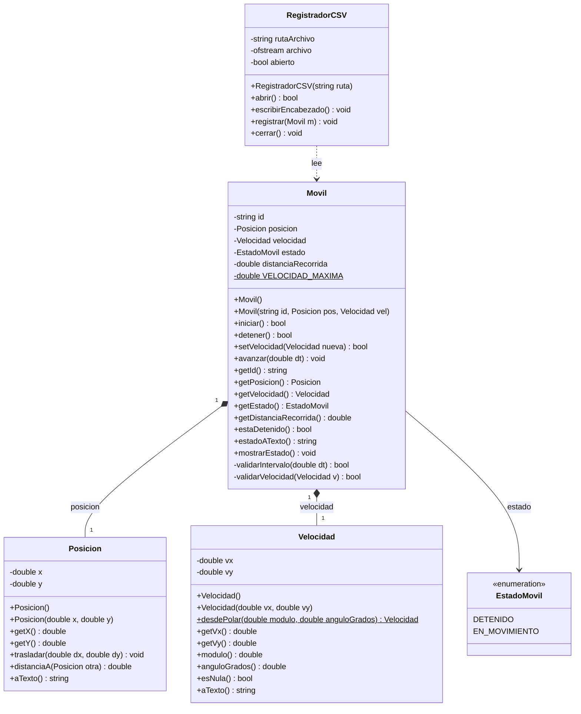

# TP1 — Actividad 4: Diagrama de clases (modelo implementado)


Juan Francisco Bazan Carrizo

Sistema para representar uno o más **móviles** capaces de desplazarse en una trayectoria
**bidimensional**. Este documento describe el modelo efectivamente implementado en la
Actividad 4 y su correspondencia con el código (`Movil.drawio` contiene el mismo diagrama
en formato editable).

**Unidades utilizadas (consistentes en todo el sistema):**

| Magnitud | Unidad |
|---|---|
| Posición (`x`, `y`) | metros `[m]` |
| Velocidad (`vx`, `vy`) | metros por segundo `[m/s]` |
| Intervalo de tiempo (`dt`) | segundos `[s]` |
| Distancia recorrida | metros `[m]` |

---

## 1. Diagrama de clases



### Cómo se leen las relaciones

| Símbolo | Relación | Significado acá |
|---|---|---|
| `*--` (rombo lleno) | Composición | `Posicion` y `Velocidad` viven y mueren con el `Movil`; son parte de él, no se comparten. |
| `-->` | Asociación / uso | `Movil` guarda un valor del enumerado `EstadoMovil`. |
| `..>` (punteada) | Dependencia | `RegistradorCSV` **usa** un `Movil` para leer sus datos, pero no lo contiene ni lo modifica. |

> El registrador está separado a propósito: el `Movil` no sabe nada de archivos ni de CSV.
> Su responsabilidad es moverse; la de persistir es de otra clase.

### Correspondencia con los archivos del proyecto

| Elemento del diagrama | Archivos |
|---|---|
| `Movil` | `Movil.h` / `Movil.cpp` |
| `Posicion` | `Posicion.h` / `Posicion.cpp` |
| `Velocidad` | `Velocidad.h` / `Velocidad.cpp` |
| `EstadoMovil` | `EstadoMovil.h` (solo cabecera) |
| `RegistradorCSV` | `RegistradorCSV.h` / `RegistradorCSV.cpp` |
| Programa de pruebas | `main.cpp` |

---

## 2. Cambios respecto de la Actividad 3

En la Actividad 3 el código era un único archivo `Movil.cpp` con la clase y el `main()`
juntos, y un modelo **1D**. Para la Actividad 4 se completó la implementación siguiendo el
anexo y se dejó registrado el motivo de cada cambio como comentario en las cabeceras.

| Actividad 3 | Actividad 4 | Motivo |
|---|---|---|
| Todo en `Movil.cpp` (clase + `main`) | Módulos `.h`/`.cpp` por clase + `main.cpp` aparte | La consigna pide compilar módulos por separado y mostrar dependencias en el `Makefile`. |
| `nombre` + `id` (dos `string`) | Un único `id` | Alcanza con un identificador; evita datos redundantes. |
| `int posicion` (1D) | `Posicion posicion` con `x`, `y` `double` | El anexo exige trayectoria **bidimensional**. |
| `int velocidadActual` (1D) | `Velocidad velocidad` con `vx`, `vy` `double` | La velocidad 2D es un **vector** (rapidez + dirección). |
| `bool encendido` | `enum class EstadoMovil` | Estado explícito, legible y ampliable; coincide con el CSV del anexo. |
| `int desplazamientoTotal` | `double distanciaRecorrida` | Distancia real acumulada; se admite parte decimal. |
| `iniciarMovil()` / `detenerMovil()` `void` | `iniciar()` / `detener()` devuelven `bool` | Informan si la operación tuvo efecto (p. ej. iniciar algo ya iniciado). |
| `modificarVelocidad(int)` | `setVelocidad(Velocidad)` `bool` | Valida contra `VELOCIDAD_MAXIMA` (50 m/s) y rechaza lo inválido. |
| `desplazar(int tiempoSegundos)` | `avanzar(double dt)` | `dt` en segundos como `double`; velocidad constante en el intervalo. |
| Sin validaciones internas | `validarIntervalo(dt)`, `validarVelocidad(v)` privadas | `dt < 0` no hace nada; un móvil detenido no cambia de posición. |
| — | Clase nueva `RegistradorCSV` | Punto opcional del anexo: registrar los estados en `.csv`. |

---

## 3. Lógica de `avanzar(dt)`

Es el único método que modifica posición y distancia:

```
avanzar(dt):
    si no validarIntervalo(dt):   -> return   // dt negativo
    si estado == DETENIDO:        -> return   // no se mueve
    dx = velocidad.getVx() * dt
    dy = velocidad.getVy() * dt
    posicion.trasladar(dx, dy)
    distanciaRecorrida += velocidad.modulo() * dt
```

Durante el intervalo la velocidad se considera **constante**, tal como indica el anexo.

---

## 4. Valores predeterminados y validaciones

**Constructor por defecto `Movil()`:** `id = "MovilSinNombre"`, `posicion = (0, 0)`,
`velocidad = (0, 0)`, `estado = DETENIDO`, `distanciaRecorrida = 0`.

| Situación | Regla |
|---|---|
| `id` vacío en el constructor | Se reemplaza por `"MovilSinNombre"`. |
| `avanzar(dt)` con `dt < 0` | Se ignora: la posición no cambia. |
| `avanzar(dt)` con el móvil `DETENIDO` | No modifica posición ni distancia. |
| `setVelocidad()` con módulo > `VELOCIDAD_MAXIMA` (50 m/s) | Se rechaza y devuelve `false`. |
| `iniciar()` sobre un móvil ya en movimiento | Devuelve `false`. |
| `detener()` sobre un móvil ya detenido | Devuelve `false`. |
