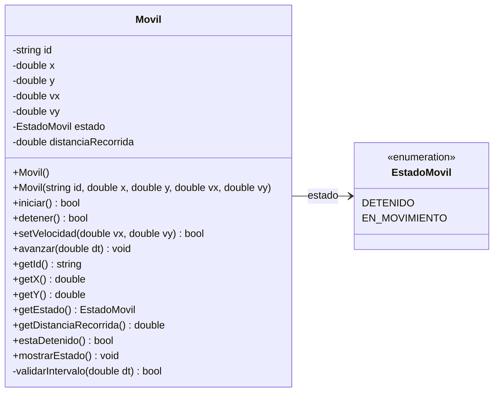
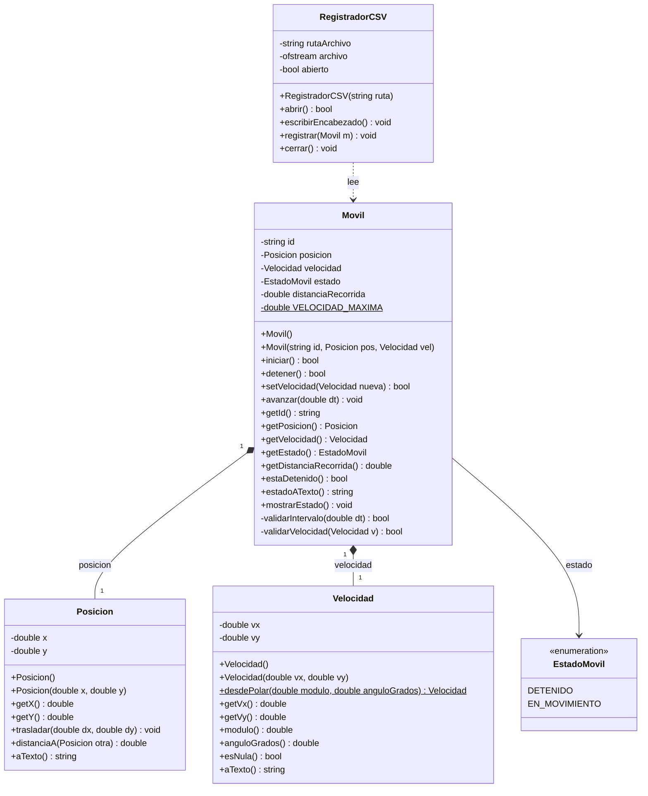

# TP1 — Actividad 3 y 4: Diagrama de clases

Sistema para representar uno o más **móviles** capaces de desplazarse en una trayectoria
bidimensional.

**Unidades utilizadas (consistentes en todo el sistema):**

| Magnitud | Unidad |
|---|---|
| Posición (`x`, `y`) | metros `[m]` |
| Velocidad (`vx`, `vy`) | metros por segundo `[m/s]` |
| Intervalo de tiempo (`dt`) | segundos `[s]` |
| Distancia recorrida | metros `[m]` |

---

## 1. Versión mínima (lo que exige la consigna)

La consigna pide *"como mínimo, una clase que represente el concepto de Movil"*.
Esta versión cumple con eso: una sola clase más un enumerado para el estado.



---

## 2. Versión completa (recomendada)

Separa los conceptos de **posición** y **velocidad** en clases propias. Esto hace explícito
que la trayectoria es bidimensional, evita que `Movil` se llene de `double` sueltos y permite
reutilizar operaciones vectoriales (módulo, ángulo, distancia entre puntos).

Se agrega además `RegistradorCSV` para el punto opcional.



### Cómo se leen las relaciones

| Símbolo | Relación | Significado acá |
|---|---|---|
| `*--` (rombo lleno) | Composición | `Posicion` y `Velocidad` viven y mueren con el `Movil`; son parte de él, no se comparten. |
| `-->` | Asociación / uso | `Movil` guarda un valor del enumerado `EstadoMovil`. |
| `..>` (punteada) | Dependencia | `RegistradorCSV` **usa** un `Movil` para leer sus datos, pero no lo contiene ni lo modifica. |

> El registrador está separado a propósito: el `Movil` no debería saber nada de archivos ni
> de CSV. Su responsabilidad es moverse; la de persistir es de otra clase.

---

## 3. Respuestas a las preguntas de la consigna

### ¿Qué información necesita almacenar cada objeto?

| Atributo | Tipo | Por qué es necesario |
|---|---|---|
| `id` | `string` | Identificación del móvil (`MovilA`, `MovilB`, …), pedida explícitamente. |
| `posicion` | `Posicion` | Estado actual en el plano; es lo que cambia con el tiempo. |
| `velocidad` | `Velocidad` | Vector `(vx, vy)`: define rapidez **y** dirección del desplazamiento. |
| `estado` | `EstadoMovil` | Permite determinar si está detenido o en movimiento. |
| `distanciaRecorrida` | `double` | Acumulador; **no** se puede calcular desde la posición porque el camino puede no ser recto. |

> **Importante:** `distanciaRecorrida` se acumula, no se deduce. Si el móvil va y vuelve al
> origen, la distancia recorrida no es cero.

### ¿Qué operaciones debe ofrecer cada clase?

Mapeo directo requerimiento → método:

| Requerimiento de la consigna | Método |
|---|---|
| Crear un móvil con valores predeterminados | `Movil()` |
| Crear un móvil indicando sus datos iniciales | `Movil(id, pos, vel)` |
| Consultar su estado actual | `getEstado()`, `estaDetenido()`, getters |
| Iniciar el movimiento de un móvil detenido | `iniciar()` |
| Detener un móvil en movimiento | `detener()` |
| Modificar su velocidad | `setVelocidad(nueva)` |
| Simular el desplazamiento en un intervalo | `avanzar(dt)` |
| Actualizar posición y distancia total | (efecto interno de `avanzar(dt)`) |
| Mostrar la información de forma clara | `mostrarEstado()` |
| *(opcional)* Registrar en `.csv` | `RegistradorCSV::registrar(movil)` |

### ¿Qué debe permanecer oculto y qué accesible desde `main`?

**Oculto (`private`):**
- Todos los atributos. Nadie debe poder hacer `movil.distanciaRecorrida = 0;` desde afuera.
- `validarIntervalo()` y `validarVelocidad()`: son detalle interno de la clase.

**Accesible (`public`):**
- Constructores, los verbos del móvil (`iniciar`, `detener`, `setVelocidad`, `avanzar`),
  los *getters* de consulta y `mostrarEstado()`.

**Sin `setter` de posición ni de distancia.** La posición sólo cambia como **consecuencia**
de `avanzar(dt)`, nunca por asignación directa: eso es lo que garantiza que la distancia
recorrida sea coherente y que un móvil detenido no pueda teletransportarse.

### ¿Qué valores predeterminados corresponde utilizar?

Constructor por defecto `Movil()`:

| Atributo | Valor | Justificación |
|---|---|---|
| `id` | `"MovilSinNombre"` | Nunca vacío, para que la salida y el CSV sean legibles. |
| `posicion` | `(0.0, 0.0)` | Origen del sistema de coordenadas. |
| `velocidad` | `(0.0, 0.0)` | Coherente con nacer detenido. |
| `estado` | `DETENIDO` | Estado seguro: no se mueve hasta que se lo pida. |
| `distanciaRecorrida` | `0.0` | Todavía no recorrió nada. |

### ¿Qué validaciones debe realizar la clase?

| Situación | Regla |
|---|---|
| `id` vacío en el constructor | Se reemplaza por el valor por defecto. |
| `avanzar(dt)` con `dt < 0` | Se rechaza: el tiempo no retrocede. La posición no cambia. |
| `avanzar(dt)` con el móvil `DETENIDO` | No modifica posición ni distancia (requisito explícito de la consigna). |
| `setVelocidad()` con módulo mayor a `VELOCIDAD_MAXIMA` | Se rechaza y devuelve `false`. |
| `iniciar()` sobre un móvil ya en movimiento | No hace nada, devuelve `false` (no es un error grave, pero se avisa). |
| `detener()` sobre un móvil ya detenido | Ídem. |
| `iniciar()` con velocidad nula | Se permite, pero conviene advertir: quedará `EN_MOVIMIENTO` sin desplazarse. |

---

## 4. Lógica de `avanzar(dt)`

Es el único método que modifica posición y distancia, y concentra la regla de negocio:

```
avanzar(dt):
    si no validarIntervalo(dt):        -> return   // dt negativo
    si estado == DETENIDO:             -> return   // no se mueve
    dx = velocidad.getVx() * dt
    dy = velocidad.getVy() * dt
    posicion.trasladar(dx, dy)
    distanciaRecorrida += velocidad.modulo() * dt
```

Durante el intervalo la velocidad se considera **constante**, tal como indica la consigna, por
eso alcanza con multiplicar por `dt` en lugar de integrar.
